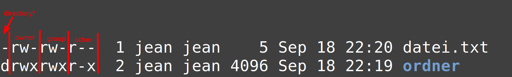

Benutzer und Rechte
===================

Benutzer
--------
Wie auf anderen Systemen ist Linux auch durch Benutzer geregelt.
Ein Benutzer kann entweder ein normaler Nutzer (wie man ihn sich normalerweise vorstellt) darstellen, 
oder auf Linux kann dies auch ein spezieller Dienst sein. Beipsielsweise ist ``www-data`` ein Benutzer,
der in der Regel den Webserver betreibt. Solche Dienste benötigen kein homeverzeichnis und existieren 
mehr, Datei-Rechte und Zugriffsrechte zu regeln. 
Sollte bspw. der installierte Webserver (welcher als ``www-data`` Prozess läuft) kompromitiert werden,
so kann dieser mit dem Rechner nicht zu viel Unfug anstellen, außer den gesamten Web-Bereich zu kompromitieren.

Jeder Benutzer auf dem Linux System hat auch einen eindeutige Benutzer-Id.
"Normale" Benutzer haben eine ID ab dem Wert ``1000``.

Administrator: Root
^^^^^^^^^^^^^^^^^^^
Aber ein normaler Nutzer hat doch auch Administrator-Rechte? Das stimmt. Aber was eigentlich auf dem System passiert:
Wenn man den Befehl ``sudo`` benutzt, checkt sudo, ob der ausführende Benutzer das Recht dazu hat, etwas als Administrator auszuführen.
Wenn dies der Fall ist, dann führt sudo einen abgekoppelten neuen Prozess als ``root`` Nutzer aus und "leitet In- und Output an den normalen Nutzer weiter".

Der root Benutzer ist auf jedem System vorhanden und besitzt die ID ``0``. 

Häufig kann man sich selber als root-Nutzer "einloggen" indem man ``sudo -i`` eingibt. 
Auf debian funktioniert das aber mit bspw. dem Befehl ``su -``.

.. tip:: 
    Soll ein Programm über eine grafische Passworteingabe gestartet werden? 
    -> ``pkexec`` anstatt von ``sudo`` verwenden.

Ein Administrator kann unter anderem folgende Dinge erledigen:

    - Benutzer hinzufügen, entfernen, Gruppen ändern, andere Administratoren löschen
    - Alle Dateien sehen, ändern, löschen. ALLE. (Auch die von anderen Benutzern und Administratoren, sofern diese nicht explizit verschlüsselt sind)
    - Programme aktualisieren, entfernen, installieren
    - Das System in jeder Hinsicht verändern
    - Andere Festplatten und installierte Systeme auslesen, verändern, oder sogar ausführen.
    - Einfach alles

.. warning:: 
    Gehen Sie daher nicht leichtfähig mit diesem Recht um!
    Achten Sie auch immer darauf, wenn nach Ihrem Passwort während der Nutzung von Linux gefragt wird. 
    In fast allen Fällen (bis auf das Entsperren des Schlüsselbunds oder SSH-Keys) wird nach dem Passwort gefragt, 
    wenn das Programm Administrations-Rechte braucht.

Sich als anderer Benutzer in der Konsole einloggen
^^^^^^^^^^^^^^^^^^^^^^^^^^^^^^^^^^^^^^^^^^^^^^^^^^
Dies funktioniert mit dem Befehl ``su``.
Mit ``su nutzer2`` "logge" ich mich als ``nutzer2`` ein, sofern dieser natürlich existiert.

.. note:: 
    ``su root`` funktioniert in der Regel auf einem Ubuntu/Linux Mint System nicht mehr, da der root Benutzer nicht mehr als solches existieren "soll".
    Bei der Einführung von Ubuntu verfolgten die Macher einen anderen Ansatz. 
    Standardmäßig deaktiviert Ubuntu die Anmeldung beim root-Konto (indem es kein Passwort für das Konto festlegt) und verwendet stattdessen sudo, 
    um Superuser-Rechte zu gewähren. Das erste Benutzerkonto erhält über sudo vollen Zugriff auf die Superuser-Rechte und kann nachfolgenden Benutzerkonten ähnliche Rechte gewähren.

Benutzerverwaltung
^^^^^^^^^^^^^^^^^^
Die Befehle ``adduser nutzername`` und ``deluser nutzername`` erstellen bzw. entfernen einen Nutzer.
Nutzernamen auf Linux werden IMMER klein und zusammen geschrieben. Es sollten auch keine Umlaute oder sonstige Zeichen verwenden.

Gruppen
-------
Mit dem Eintrag von Gruppen wird definiert, was ein Benutzer machen darf und was nicht. 
Im Linux-Desktop Bereich scheint das Gruppen-Berechtigungs-System allerdings im Dekstop-Bereich sehr stiefmütterlich behandelt zu sein und ist an vielen Stellen obsolet. 

Folgende Rechte können für Desktop-Nutzer interessant sein:

- **cdrom:** Das DVD/CD-Laufwerk darf benutzt werden
- **lpadmin:** Drucker dürfen verwaltet und eingerichtet werden. (Drucken kann man auch ohne diese Gruppe)
- **plugdev:** USB-Sticks, Partitionen, externe Laufwerke können ein/ausgehängt werden
- **sambashare:** Ordner-Freigaben dürfen mit Samba erstellt werden
- **sudo:** Administrations-Rechte (!)
- **nopasswdlogin:** Jeder kann sich ohne Eingabe des Passworts einloggen

Für Servernutzer ist dieser Punkt spannender: Gruppen werden dafür verwendet, einzelnen Diensten (System-Nutzern) Berechtigungen zu erteilen.
Beispielsweise wenn ein Benutzer in der Gruppe ``docker`` ist *(entspricht: Das "Recht" docker hat)*, kann er ohne weiteres docker-Befehle ausführen
und muss dabei nicht zwingend ein Administrator sein.

Also kann man für jeden einzelnen Serverdienst einen eigenen Nutzer erstellen und ihn durch Gruppen-Zuweisung nur so viel Rechte geben,
wie man es wirklich muss, ohne ihm Administrator-Rechte einzuräumen.
Sollte dieser Nutzer gepakert werden, kann er so als Nicht-Administrator weniger anstellen.

Interessante Gruppen für Server-Administratoren können unter anderem sein:
- Alle Gruppen für Desktop-Nutzer
- **docker:** Wenn der Docker-Dienst installiert wurde, kann docker gesteuert werden
- **mail:** Es kann das interne Mail-System gesteuert werden
- **mysql:** MySQL kann administriert werden. (Wenn installiert)
- **www-data** Rechte eines üblichen Webservers erlangen. (Apache, nginx, caddy, ...)

Benutzer zu Gruppe hinzufügen:
^^^^^^^^^^^^^^^^^^^^^^^^^^^^^^
- ``usermod -a -G gruppenname benutzername`` fügt einen Benutzer zu einer Gruppe hinzu.
- ``gpasswd -d gruppenname benutzername`` entfernt einen Nutzer von einer Gruppe.

Gruppe erstellen/löschen
^^^^^^^^^^^^^^^^^^^^^^^^

.. note:: 
    Die üblichen Gruppen werden mit der Installation der entsprechenden Software direkt miterstellt.

- ``addgroup gruppenname`` 
- ``delgroup gruppenname``

Dateirechte
-----------
Das Gegenstück zu den Benutzern und Gruppen im Rechte-System sind die Dateien.
Alles in Linux ist eine Datei: Eine "normale" Datei, ein Programm, der Kernel, sogar Geräte oder System-Nachrichten werden in Dateien repräsentiert.

Somit kann man nahezu alle Rechte direkt in den Datei-Metadaten abbilden. 
Dies ist zwar auf den ersten Blick zwar nicht direkt intuitiv, aber ist so einfach, wie genial.
Das System ist so extrem Fehlerresistent, minimalistisch, schnell und eindeutig.

Insgesamt gibt es drei verschiedene Slots für die Rechtebeschreibung einer Datei:

- **Owner:** Eine Datei hat immer genau einen Besitzer. Dieser (und root) kann die gesamten Berechtigungen der Datei anpassen
- **Group:** Alle Benutzer in der gleichnamigen Gruppe können hiermit referenziert werden.
- **Other** Das Recht alle anderen Benutzer (die weder Besitzer der Datei noch in der Gruppe sind) können hier konfiguriert werden.

Für jeden dieser drei Slots gibt es jeweils drei Rechte:

- **Ausführen:** Dateien können als Programm ausgeführt werden. (1, x)
- **Schreiben:** Der Inhalt dieser Datei darf verändert werden. (2, w)
- **Lesen:** Der Inhalt der Datei darf gelesen werden. (4, r)

Zusammen ergibt das folgende Beschreibung der Metadaten:

::

    jean@rechner:~$ ls -al
    drwxrwxr-x  3 jean jean 4096 Sep 18 22:20 .
    drwxrwxr-x 16 jean jean 4096 Sep 18 22:19 ..
    -rw-rw-r--  1 jean jean    5 Sep 18 22:20 datei.txt
    drwxrwxr-x  2 jean jean 4096 Sep 18 22:19 ordner

- ``datei.txt`` kann von dem Benutzer ``jean`` gelesen (r) und geschrieben (w) werden, ebenfalls von der Gruppe ``jean``. Andere hingegen können die Datei nur lesen.
- ``ornder``:Das x jeweils (was für ausführen steht), bedeutet bei Ordnern, dass dieser von den jeweiligen Nutzern betreten werden kann. 
    In dem Ordner selber können Dateien vom Besitzer und der Gruppe erstellt/gelöscht/geändert werden (r), von anderen nicht. Der Besitzer, die Gruppe und andere können den Inhalt des Ordners auflisten.

Dateirechte ändern
^^^^^^^^^^^^^^^^^^

Die Rechte können mit dem Befehl chmod geändert werden. Dieser Befehl ist sehr mächtig und vielfältig, 
weswegen hier nur auf die wichtigsten Anwendungsfälle eingegangen wird:

- ``chmod +x pfad`` Der Besitzer, der Gruppe und anderen erlauben, sie als Programm auszuführen.
- ``chmox u+x pfad`` Dem Besitzer der Datei (user) das Recht auszuführen erteilen. (+x)
- ``chmod o-rwx pfad`` Anderen (others) alle Rechte (Lesen, Schreiben, Ausführen) entziehen (-).
- ``chmod og+rwx pfad`` Der Gruppe (group) und Anderen (others) alle Rechte erteilen (+rwx)

- ``chmod 644 pfad`` Der Besitzer darf lesen und schreiben, alle anderen nur lesen. (4+2, 4, 4)
- ``chmod 744 pfad`` Der Besitzer darf lesen, schreiben und ausführen. Alle anderen nur lesen. (4 + 2 + 1, 4, 4)
- ``chmod 660 pfad`` Der Besitzer und die Gruppe dürfen lesen und schreiben, Alle anderen nichts. (4 + 2, 4 + 2, 0)

Eigentümer/Gruppe ändern
^^^^^^^^^^^^^^^^^^^^^^^^
- ``chown benutzer:gruppe pfad`` Einer einzelnen Datei
  ``chown benutzer:gruppe -R pfad`` eines gesamten Ordners (und alle darunter)

**Beispiel:** ``sudo chown -R www-data:www-data /var/www/html``

Benutzer zum Administrator machen
---------------------------------
Dafür muss man den Nutzer der Gruppe ``sudo`` hinzufügen:

::

    usermod -aG sudo benutzername

Passwort vergessen
-----------------------
Ein Administrator kann das Passwort eines anderen Nutzers mit dem Befehl ``passwd benutzername`` zurücksetzen/neu setzen.

Administrator-Passwort vergessen
^^^^^^^^^^^^^^^^^^^^^^^^^^^^^^^^
Was ist los, wenn man das Passwort des Administrators vergessen hat?
Dafür gibt es keinen offiziellen Weg, den man natürlich auch nicht zur Laufzeit des Systems beschreiten kann.

Wir fangen zuerst an, den Bootloader GRUB kurzzeitig zu manipulieren. 
Das Root-System wird früher als gedacht schreibbar gemacht, sowie wird anstattdessen der normale Linux-Startup auf eine einzige Konsole umgeleitet:

- Im Grub-Menü auf "Erweiterte Optionen" gehen und dann dort auf dem ersten Eintrag die Taste ``e`` drücken.
- Beim Linux-Start-Befehl das ``ro`` (read only) auf ``rw`` ändern (read write), sowie am Ende ``init=/bin/bash`` hinzufügen. (Auf englische Tastatur achten!)
- Dann mit ``F10`` den kurzzeitg veränderten Befehl starten. (Dauert wenige Sekunden)
- In der Konsole das Root-Dateisystem ("Haupt-Partition") mit ``mount -n -o remount,rw /`` einhängen
- Mit ``passwd root``  oder ``passwd nutzername`` so das Passwort zurücksetzen.  (Auf englische Tastatur achten!!)
- Zum Ende mit ``exec /sbin/init`` den Rechner wieder normal neustarten.