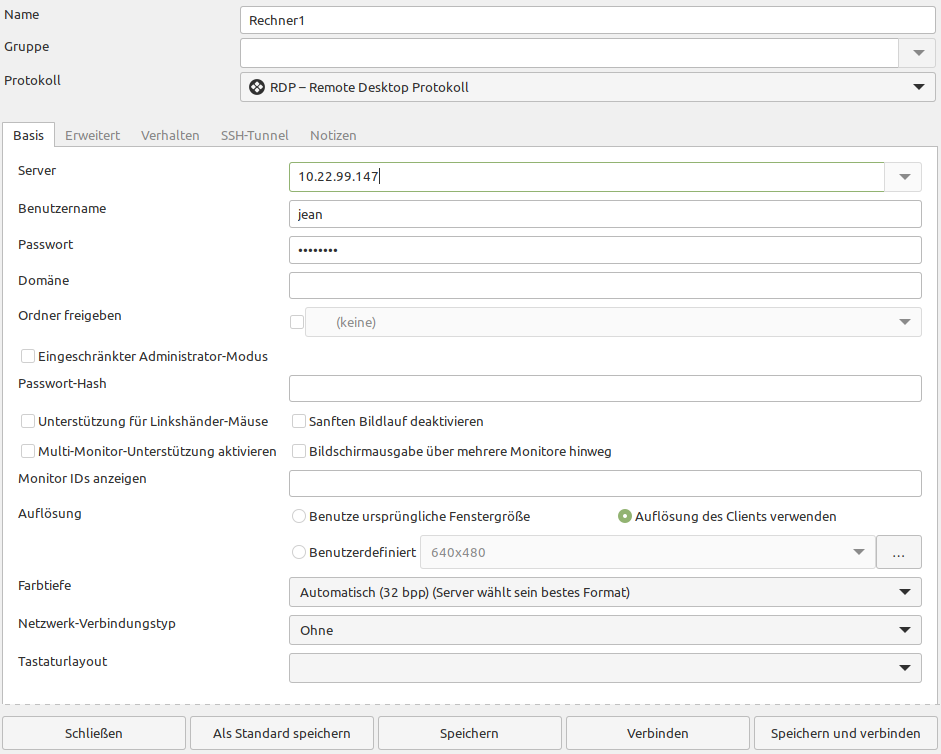

Linux Remote
============

OpenSSH
-------

Um sich auf einen anderen Linux-Rechner aufzuschalten, wird üblicherweise die SSH verwendet. 
Diese stellt folgende essentiellen Eigenschaften sicher:

- Authentifizierung der Gegenstelle -> kein Ansprechen falscher Ziele
- Verschlüsselung der Datenübertragung -> kein Mithören durch Unbefugte
- Datenintegrität -> keine Manipulation der übertragenen Daten

Möchte man sich auf einen Rechner verbinden, benötigt man die IP-Adresse oder den Domain-Namen, 
den Benutzernamen und evtl. den Port, welcher standardmäßig auf 22 eingestellt ist.
Folgende Beispiele können helfen:

::

    ssh benutzer@1.2.3.4
    ssh benutzer@1.2.3.4 -p 42022 # SSH Dienst über Port 42022 erreichbar
    ssh benutzer@www.example.com

openssh-Server installieren
^^^^^^^^^^^^^^^^^^^^^^^^^^^
Damit man auf einen anderen Rechner zugreifen kann, muss auf diesem openssh-server installiert sein. 
Ebenfalls muss bei der Firewall SSH erlaubt sein.

::
    sudo apt install openssh-server
    sudo ufw allow ssh

Authentifizierung über Zertifikate
^^^^^^^^^^^^^^^^^^^^^^^^^^^^^^^^^^
Passwörter in der Authentifizierung für Server sind leider relativ unsicher. 
Je kürzer das Passwort, desto schneller kann ein Passwort von vielen Instanzen im Netz geknackt werden.
Am besten ist es also, sich über ein Zertifikat in SSH anzumelden. 

Dafür müssen wir auf unserem Rechner erstmal ein Zertifikat erstellen:

::

    ssh-keygen
    cat ~/.ssh/id_rsa.pub

Die Standardeinstellungen reichen für uns aus. Es ist sehr empfohlen, ein Passwort für das Zertifikat zu setzen.
Nachdem wir uns die Datei anzeigen haben lassen, müssen wir den gesamten Inhalt auf dem entfernten Rechne mit dem openssh-Server speichern:

::

    mkdir .ssh
    nano ~/.ssh/authorized_keys

Der Inhalt der Datei muss so aussehe. (Jede Zeile steht für ein öffentliches Zertifikat eines Rechners, der sich so auf den Server einloggen kann)

:: 
    
    ssh-rsa AAAAB3NzaC1yc2EAAAADAQABAAABgQCVnOFEQ12+kNV1Pg/FcEwZiftVym7ixswd9X7NoTsq99EqQw8zsXg2nSlApHZ1VDdYj48UX79Ibbhp1RFuqHJslch8b6uXOUIWI6f3KEnRsbCaC65AR6y7Lmd8ir+R9x+DTXllfNj7Ef3iNdRAiaZHG+2fXrR8+HIu6263oIiCgvzoA5kmhjKNICOtUuc8Hu2KS8bWeFlEYg+wc2unZLKTRv/3VzfYAWLj6NUW5Ng05D1BqJWE8CGZeh2+jwSn8qgE5drRBd4XwkoJHh5kNQ+yQRP7SCAJLuHDHPFGTghFz5xhshMSjFVzFoR4x3vXIeQ0yoIVvNPYF5GicR75AQE9R/6fyE1MutdmJNBCDYOdH/PxTkLNR8sEfnpV/T8ceog8j0Amljb4JiZWbP5KUVMhnl7qeWcTRBrpKWaSnWYeYP5AAjGLn1bJkP1u4bW/CGe+sN/reGvYc5pVs7/7MmEa9XmojcB9Z7t+cDUMrawSwOg5A5hNTpCGnjN54rxVKRs= root@debian

Daraufhin kann man sich nun auch ohne Eingabe des Server-Passwortes auf dem Server anmelden.

Zum Ende empfiehlt es sich, in der ``/etc/ssh/sshd_config`` Datei die Zeile ``#PasswordAuthentication yes`` auszukommentieren und auf ``no`` zu ändern.
Damit kann man sich nur noch von eingetragenen Rechnern über das Zertifikat einloggen. Passwort-Logins funktionieren somit nicht mehr.
Am Ende sollte die Datei an der entsprechenden Stelle so aussehen: 

::
    ...
    #IgnoreRhosts yes

    # To disable tunneled clear text passwords, change to no here!
    PasswordAuthentication no
    #PermitEmptyPasswords no

    # Change to yes to enable challenge-response passwords (beware issues with
    ...

RDP
---

Neben SSH gibt es auch Methoden, auf entfernten Rechnern eine vollwertige Desktop-Sitzung zu eröffnen. 
Eines der verbreitesten Protokolle ist das *Remote Desktop Protokoll* (RDP).
Dadurch kann man durch ein Programm auf den Desktop des entfernten Rechners zugreifen.

Entfernter Rechner
^^^^^^^^^^^^^^^^^^
Um auf unseren Rechner über die Ferne zuzugreifen, müssen wir ``xrdp`` installieren.

::
    sudo apt install xrdp
    ip a

Außerdem benötigen wir die IP-Adresse unseres Rechners, um auf diesen später zugreifen zu können.
Diese kann man ganz einfach in den Netzwerkeinstellungen unter dem Zahnrad ablesen (IPv4-Adresse bevorzugt) oder mit dem oben gezeigten Befehl anzeigen lassen.

.. note:: 
    Wenn die Firewall aktiv ist, muss man in den Firewall-Einstellungen den Port für RDP (3389) erlauben: ``sudo ufw allow 3389``

Rechner vor Ort
^^^^^^^^^^^^^^^
Auf diesem Rechner müssen wir lediglich das Programm ``Remmina`` aus der Anwendungsverwaltung installieren.
Wir nehmen in diesem Beispiel die Flatpak Variante.

In Remmina fügen wir eine neue Verbindung links oben über das '+' hinzu.
Als Protokoll wählen wir ``RDP - Remote Desktop Protokoll``
Unter 'Server' tragen wir Dir IP-Adresse des entfernten Rechners ein.
Als Benutzername und Passwort tragen wir die Anmeldedaten des entfernten Rechners ein.
Unter Auflösung ist die Einstellung ``Auflösung des Client verwenden`` empfohlen.
Am Ende können Sie auf ``Speichern und verbinden`` klicken.

Ein korrektes Einstellungsfenster sieht so aus:

.. note:: 
    Ein Benutzer kann grafisch nur einmal angemeldet sein. 
    Es ist nicht möglich, dass der gleiche Benutzer vor Ort und einmal entfernt gleichzeitig angemeldet ist.
    
    Auf dem entfernten Rechner sieht man auch nichts auf dem Bildschirm,
    wenn jemand aus der Ferne angemeldet ist.

    Die Rechner sollten miteinander im gleichen lokalen Netzwerk sein. 

.. tip:: 
    Richtet man zusätzlich eine VPN Verbindung ein, 
    kann man so ohne Probleme auch auf Rechner in hunderten km Entfernung zugreifen.

.. warning:: 
    Aktivieren Sie RDP auf Server direkt im Internet erreichbar nicht zum Spaß! 
    Je mehr auf Ihrem Server läuft, ist die Wahrscheinlichkeit für ein potentielles Einfallstor höher.

Dateien versenden
^^^^^^^^^^^^^^^^^
Teilweise wird dafür noch das File Transfer Protocol (FTP) verwendet, welches aber unverschlüsselt ist und dadurch nicht empfohlen ist!
Das SSH File Transfer Protocol oder Secure File Transfer Protocol (SFTP) ist eine für SSH entworfene 
Alternative zu FTP, die hingegen Verschlüsselung ermöglicht.

Ist ``openssh-server`` auf dem entfernten Rechner schon installiert, kann man sich mit dem Befehl ``sftp`` darauf verbinden.
Folgende Beispiele helfen:

::
    sftp jean@1.2.3.4
    sftp -P 42022 jean@1.2.3.4 # Wenn SSH über den Port 42022 erreichbar ist

Mit dem Befehl ``put`` kann man Dateien an den Server senden, mit ``get`` sie herunterladen.
Folgende Beispiele helfen:

::
    put datei-eigener-rechner /absoluter/pfad/auf/dem/server/

    put -R ./relativer/pfad/auf/dem/eigenen/rechner/ordner/ /absoluter/pfad/auf/dem/server/
    put -R /absoluter/pfad/auf/dem/eigenen/rechner/ordner/ ./relativer/pfad/auf/dem/server/

    get -R /ordner/auf/dem/server
    get /datei/auf/dem/server

Am Ende muss man sich aus der Umgebung wieder ausloggen, was man bspw. mit ``exit`` machen kann.